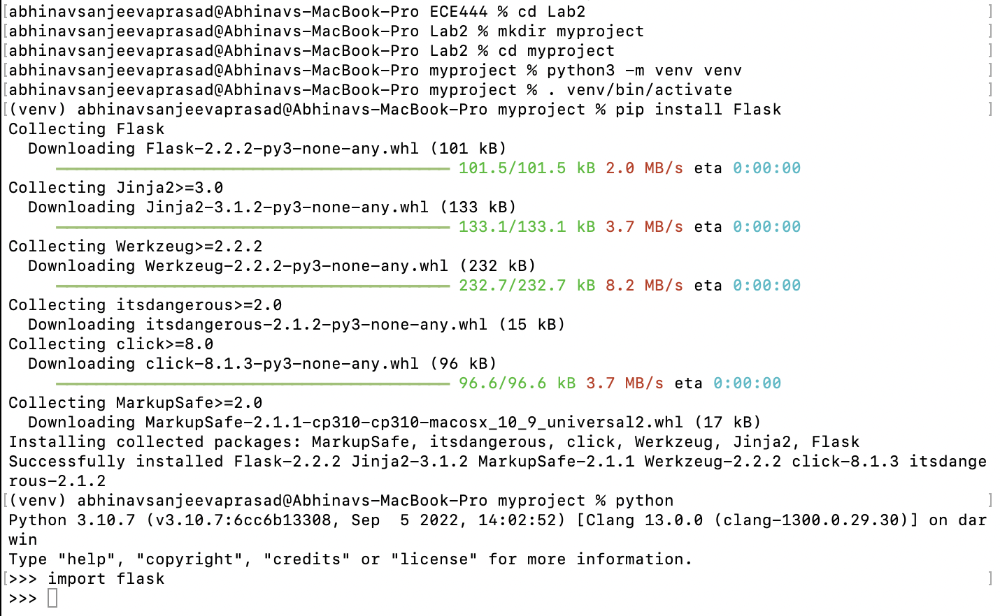
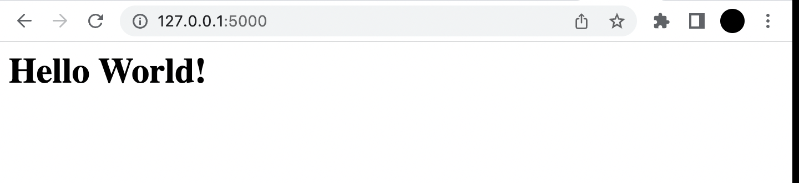
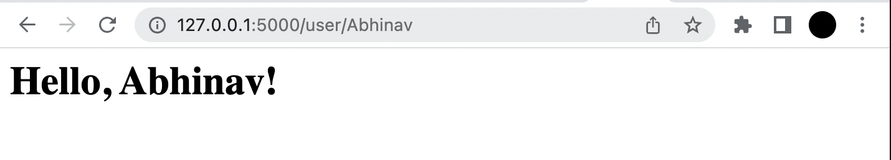

# ECE444-F2022-Lab2
Name: Abhinav Sanjeeva Prasad
This repo is a clone of: https://github.com/miguelgrinberg/flasky. 

**Activity 1**

**Activity 2**

Commit 1: Added hello.py and reproduced example 2-1 that displays "Hello, World!"

Commit 2: Reproduced example 2-2 that displays "Hello, Abhinav! by using a dynamic route"

